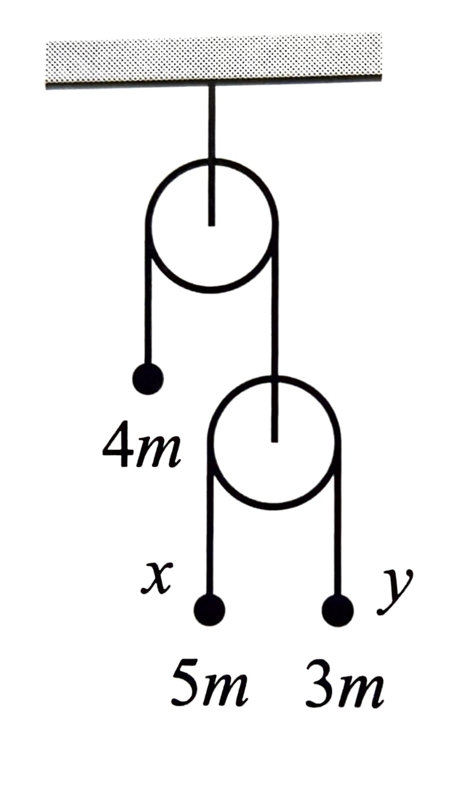

## Reading:  
Taylor, Chapter 13.1 - 13.6

This week - Hamiltonians

You may work together and get help from other students. Your solutions must be written in your own words, without looking at someone else's solutions while you write them.

Don't forget the criteria we are looking for in your solutions (see the Expectations page).

## Schedule changes for the week:
 - No class or office hours on Tuesday
 - Reading due Thursday before class (not Tuesday)
 - Final copy of HW 10 due Thursday night
 - Additional office hour Thursay 1-2 PM in Ted's office (L109)

## Assignment:
# No class Tuesday! (faculty plenary)

# For class on Thursday:

1. 13.4
2. 13.3

# Independent problems (due Friday Nov 22):
 - *R3 and C3:* Last week you were tasked with showing the generalized momenta for the atwood machine below. If you took the displacement of the $$5m$$ mass from its initial position to be $$x$$ and that of the $$3m$$ mass to be $$y$$, the generalized momenta should have been $$\frac{\partial\mathcal{L}}{\partial\dot{x}}=m\left(6\dot{x}+\dot{y}\right)$$ and $$\frac{\partial\mathcal{L}}{\partial\dot{y}}=m\left(\dot{x}+4\dot{y}\right)$$. Show that, in this formulation, the lagrangian is invariant under a simultaneous translation of $$x\to x+A\epsilon$$ and $$y\to y+B\epsilon$$, and that the momentum $$P=A\frac{\partial\mathcal{L}}{\partial\dot{x}}+B\frac{\partial\mathcal{L}}{\partial\dot{y}}$$ is conserved.  What theorem explains the relation between these two facts?
    
 - *R4 and Q4:* Two particles are connected by a spring such that their reduced mass $$\mu$$ interacts via a potential energy $$U = \frac{1}{2}kr^2$$, where $$r$$ is the distance between the particles. *R4* Write down the effective potential $$U_\mathrm{eff}\left(\vec{r}\right)$$. Remember to use the fact that the angular momentum $\ell$ is constant to express the quantity as a function of $$r$$. *Q4* For what radius can this system exhibit a stable, circular orbit?

